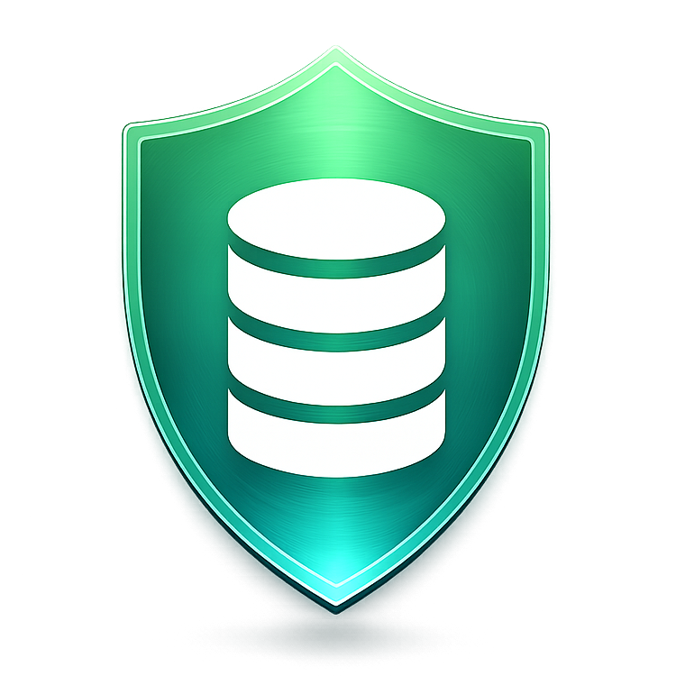
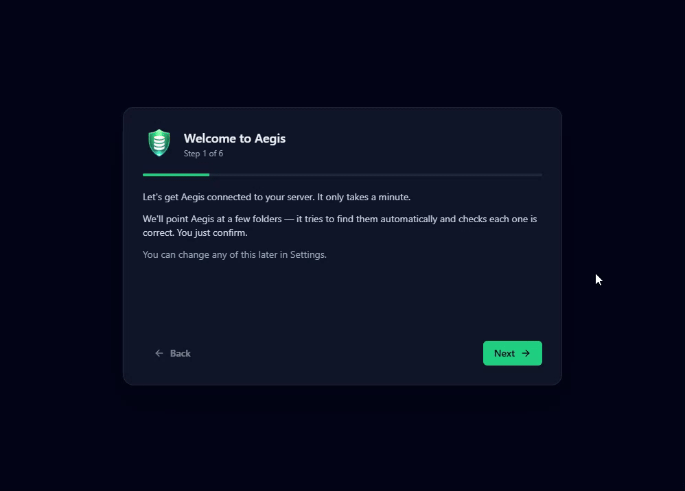
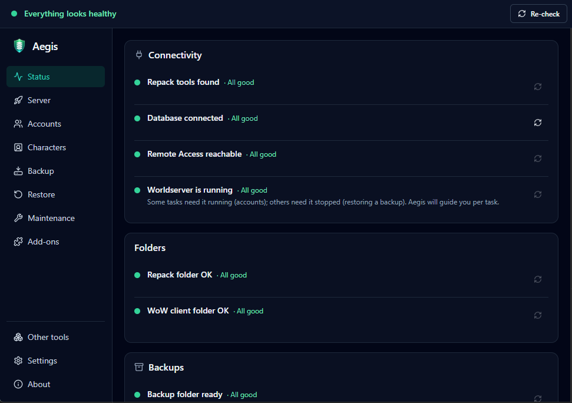
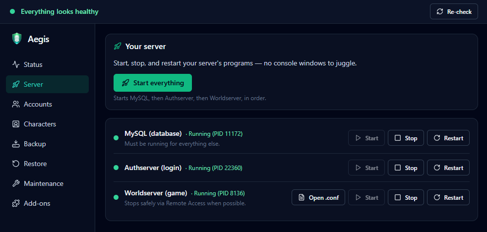
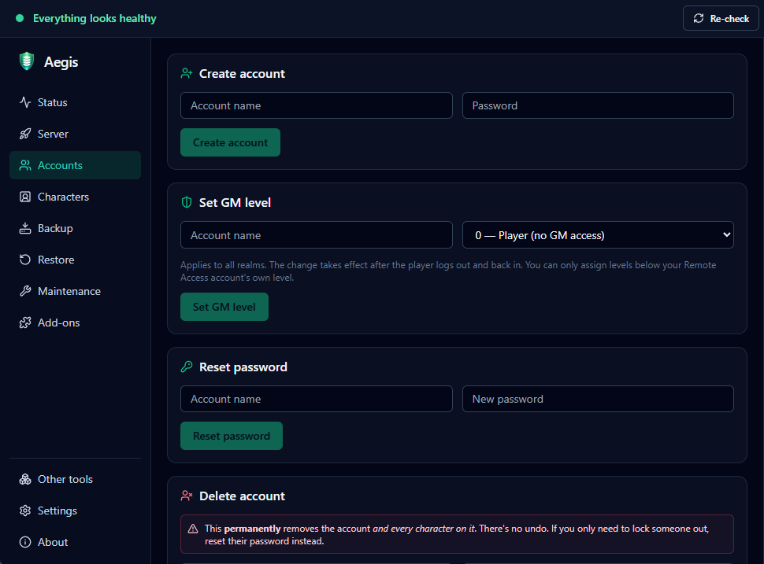
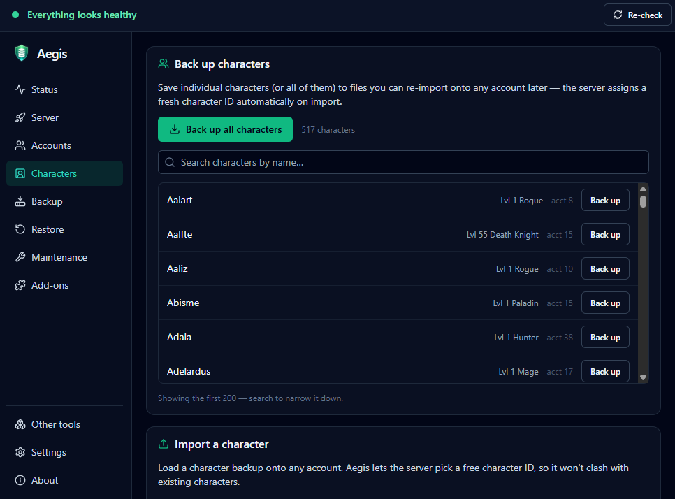
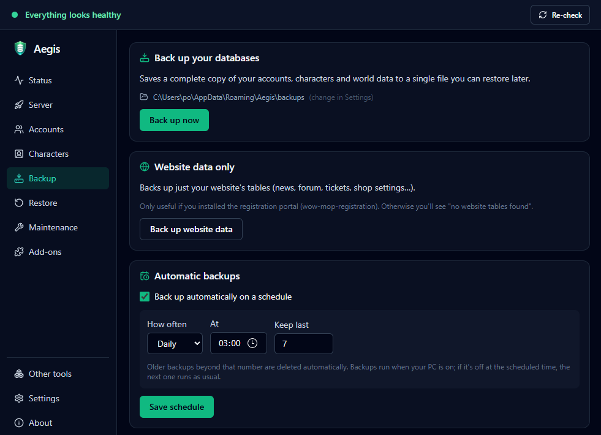
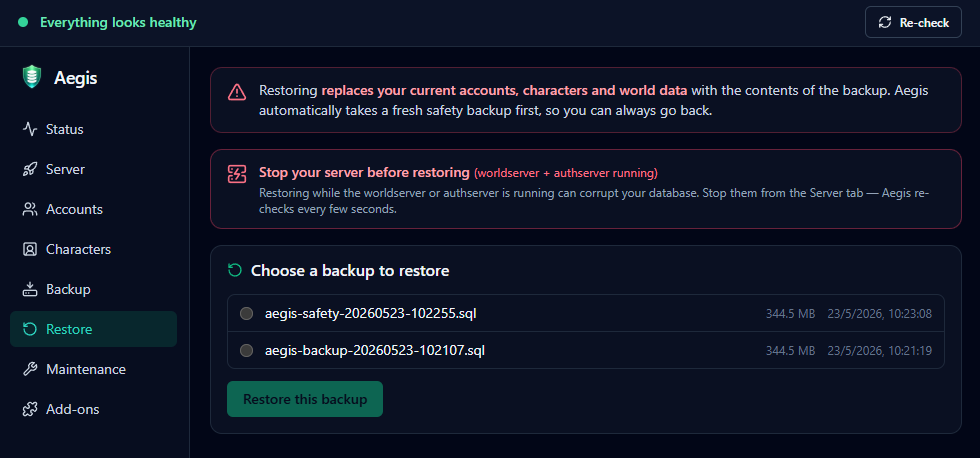
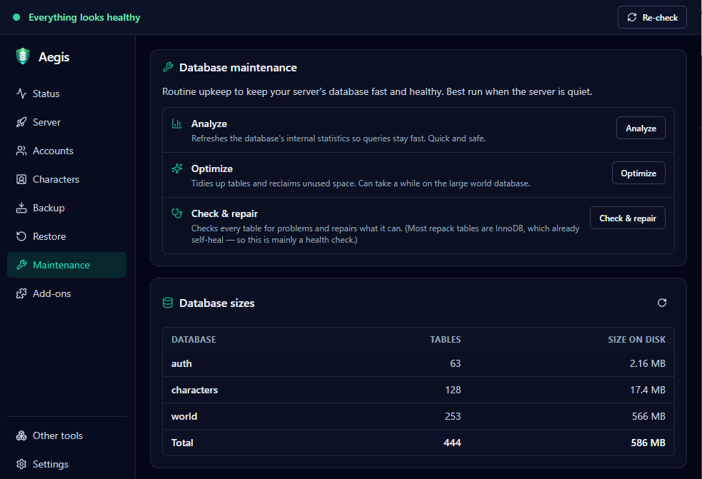
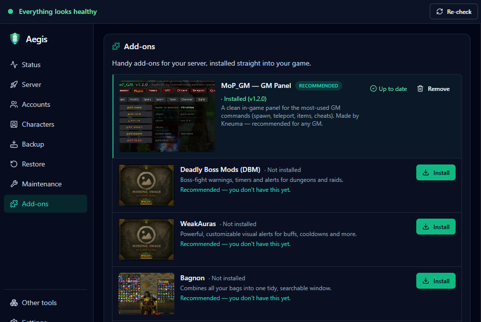

<p align="center">
  
</p>

<h1 align="center">Aegis</h1>

<p align="center">
  A friendly Windows app that makes running your <strong>EmuCoach Mists of Pandaria</strong> server easy —
  back up your database, manage accounts and characters, install add-ons, schedule automatic backups,
  and more. All with simple buttons.
  <br>No command line. No HeidiSQL. No SQL knowledge needed.
</p>

<p align="center">
  
  
  
  
  
  
</p>

> 💛 **Find Aegis useful?** It's free and open-source, built in spare time for the EmuCoach community. If it saved you a headache, a coffee genuinely helps it keep growing — see [Support the Project](#support-the-project).
>
> [](https://ko-fi.com/kneuma)

> ⚠️ **In development** — Aegis is being built in the open. The first downloadable release is coming soon. Until then you can [build it from source](#building-from-source) or watch the repo for the release.

## Table of Contents

- [What is Aegis?](#what-is-aegis)
- [What it can do](#what-it-can-do)
- [Preview](#preview)
- [Download & Install](#download--install)
- [First time you open it](#first-time-you-open-it)
- [Keeping it up to date](#keeping-it-up-to-date)
- [Is it safe?](#is-it-safe)
- [Troubleshooting & Help](#troubleshooting--help)
- [Building from source](#building-from-source)
- [Support the Project](#support-the-project)
- [License](#license)

## What is Aegis?

If you run your own EmuCoach MoP 5.4.8 repack, you already have full control over it — but doing
the everyday jobs usually means typing database commands, installing extra programs, or following
fiddly guides.

**Aegis turns those jobs into buttons.** It talks to your server using the tools that already came
with your repack, so there's nothing extra to install and nothing to configure by hand. It's made
for server owners of *every* skill level — if you can install a repack, you can use Aegis.

## What it can do

- 🩺 **Health dashboard** — One screen that tells you, at a glance, whether everything's working:
  is your database reachable, are the server tools where Aegis expects them, is Remote Access on,
  is the worldserver running, are your repack and client folders still there, when was your last
  backup, would Restore work right now. Problems come with **plain-English fixes**, never raw error
  messages.
- 🚀 **Server control** — Start, stop and restart your MySQL / authserver / worldserver from one
  page. **"Start everything"** brings the whole server up in the correct order with a single click.
  Stopping the worldserver uses a safe save-and-shutdown over Remote Access. One click also opens
  `worldserver.conf` in your editor.
- 👥 **Account management** — Create accounts, set GM levels, reset passwords, and delete accounts
  — all without touching the database. The worldserver does the password hashing itself, so logins
  always work. If your Remote Access account can't grant a GM level high enough, Aegis offers a
  guarded direct-DB override.
- 🧙 **Character backup & import** — Back up one character or all of them in one go, and import
  character dumps onto any account. Aegis computes a safe, collision-free character ID across
  every `character_*` table — no more "Transaction failed" duplicate-key surprises from orphan rows.
- 💾 **One-click backups** — Save a complete copy of your accounts, characters and world data, or
  just your website tables. Aegis shows you the size and a per-database sanity check.
- ⏰ **Automatic backups** — Schedule daily or weekly backups (via Windows Task Scheduler). Choose
  the time, choose how many to keep, Aegis handles the rest — even when the app isn't open.
- ♻️ **Safe restore** — Put a backup back if something goes wrong. Aegis always takes a fresh
  safety backup *first*, asks you to type a confirmation, and refuses to restore while your server
  is running (which could corrupt your data). The Restore page polls live, so the moment you stop
  the server it lets you continue. Belt and braces.
- 🔧 **Database maintenance** — Analyze, optimize or check your databases for problems with one
  button each, and see a tidy on-disk **size per database + total** so you can spot growth.
  Honest about what each action actually does on InnoDB.
- 🧩 **Add-ons** — Install handy add-ons into your game with one click. **Your GM panel** is
  featured at the top; **14 popular community add-ons** (DBM, WeakAuras, Bagnon, Details!, OmniCC,
  Recount, AtlasLoot, Bartender4, Gatherer, TellMeWhen, Skada, NPCScan, Quartz, Postal) come
  bundled and install offline. One click to remove, too.
- 🧰 **Other tools** — Direct links to the wider Aegis-ecosystem tools (the AI assistant, the in-game
  GM panel, the registration website, the Telegram monitor).
- ⚙️ **Auto-detected paths + first-run wizard** — Aegis finds your repack, server programs and
  game client by their contents (not by hard-coded names), so renamed install folders still work.
  Every path field has a native **Browse** button and a live "this folder looks right" check, so
  setup is point-and-click. Paths are revalidated on every start — if you move your repack, Aegis
  tells you on the Status page instead of failing silently.

## Preview

### 🎬 Setup walkthrough
*From the first launch to a green Status — auto-detected folders, database config read straight
from `worldserver.conf`, Remote Access test, all in under a minute.*



### Health dashboard
*Color **and** text everywhere — one glance tells you what needs attention. Connectivity, folders,
backups: everything proactively checked at every start. If something's wrong, the panel says what,
why, and exactly what to do. The raw (redacted) details quietly go to a log file you can attach
to a GitHub issue.*



### Server control
*Start / stop / restart your worldserver, authserver and MySQL, or bring the whole stack up in the
right order with "Start everything". Worldserver stops safely via Remote Access when it can.
One-click open for `worldserver.conf` straight in the row.*



### Account management
*Create accounts, set GM levels, reset passwords, and **delete accounts** — all through Remote
Access, with a typed-name confirm on the destructive one. The worldserver itself hashes
passwords, so logins always work.*



### Characters
*Search hundreds of characters, back up any one of them (or all in a single RA session), and
import a character dump onto any account. Aegis computes a safe character ID across every
`character_*` table so there are no orphan-row collisions on import.*



### Backup + automatic schedule
*Full database backup with size + row-count sanity. Schedule daily or weekly backups with
auto-rotation. There's also a "Website data only" button for the registration portal's tables.*



### Safe restore
*Aegis takes a fresh safety backup first, asks you to type a confirmation, and refuses to restore
while your worldserver or authserver is running — polling live, so the gate opens the moment you
stop them.*



### Database maintenance
*Analyze (refresh statistics), Optimize (reclaim space) and Check & repair, with honest copy
about what each does on InnoDB. Plus a live size summary across every database — and the total.*



### Add-ons
*Your GM panel featured at the top; 14 popular community add-ons bundled with the app, installed
offline with one click. Remove just as easily.*



## Download & Install

> ⚠️ The first release isn't out yet — this is how it'll work once it is. For now, see
> [Building from source](#building-from-source).

1. Go to the [**Releases**](https://github.com/timoinglin/aegis/releases) page and download the
   latest **`Aegis-Setup.exe`**.
2. Double-click it to install.
3. Open **Aegis** from your Start menu or desktop. Done!

That's the whole install — no command line, no extra programs, nothing to set up by hand.

### "Windows protected your PC"

The first time you run Aegis, Windows might show a blue **"Windows protected your PC"** box. That's
normal for a small free tool like this one (it just means we haven't paid for an expensive
certificate). It's safe to continue:

1. Click **More info**.
2. Click **Run anyway**.

You'll only need to do this once.

## First time you open it

Aegis walks you through a quick setup the first time:

1. It tries to **find your repack automatically** — both the **Repack** folder (with worldserver.exe)
   and the **`_Server`** folder (with mysql inside). If it can't, just hit **Browse** to point Aegis
   at them. Every path field has a live ✓/✗ check so you know it's the right folder.
2. It **reads your database settings** from `worldserver.conf` automatically, and lets you test the
   connection.
3. You enter your **Remote Access** login (or skip it for now — there's a built-in guide for setting
   it up on fresh repacks, with a one-click button to open `worldserver.conf` in your editor).
4. It detects your **WoW client folder** so it can install add-ons later.
5. Done — the Health dashboard turns green and you can start using the buttons.

Your settings are saved on your PC (in your `AppData\Aegis` folder), so you only do this once.

## Keeping it up to date

Aegis can check for new versions from inside the app and update itself when you click the button —
no reinstalling, no hunting for downloads. *(Coming with the first release.)*

## Is it safe?

Aegis is built to be careful, because we know a wrong click on a server can ruin your day:

- 🛟 **Backups before anything risky.** Restoring always takes a fresh safety backup first, so you
  can always go back.
- ✋ **It asks before doing anything destructive** — restore needs a typed confirmation, deleting an
  account needs you to re-type its name, and Aegis won't let you restore while your server is
  running (it polls live, so the moment you stop it, the gate opens).
- 🔒 **Passwords are never shown or saved in plain text.** Account passwords are handled by your
  own server. Database backups stream straight to disk via the bundled `mysqldump` with consistent
  snapshots — no manual SQL.
- 📋 **Everything is written to a log file** (in your `AppData\Aegis\logs` folder) with passwords
  redacted. If you ever need help, you can attach that log so it's easy to see what happened.

## Troubleshooting & Help

This is a free project maintained by one person, so support works best through **GitHub** rather
than DMs — that way the fix helps the next person too:

- The **Health dashboard** explains most problems and how to fix them, right inside the app.
- Still stuck? [**Open an issue**](https://github.com/timoinglin/aegis/issues) and attach your log
  file from `AppData\Aegis\logs` — that's the fastest way to get help.

## Building from source

For developers (you don't need this to *use* Aegis). Requires
[Node.js](https://nodejs.org) and the [Rust toolchain](https://rustup.rs).

```bash
git clone https://github.com/timoinglin/aegis.git
cd aegis
npm install
npm run app:dev      # run in dev mode
npm run app:build    # build a release installer
```

Aegis is built with [Tauri](https://tauri.app/) (Rust backend) + React + TypeScript + Tailwind +
shadcn/ui. It shells out to the repack's own bundled `mysql` / `mysqldump` binaries and talks to the
worldserver's Remote Access — it never bundles its own database tools.

See [RELEASING.md](RELEASING.md) for the steps to cut a signed release.

## Support the Project

Aegis is **free and MIT-licensed**, and it always will be — no paywall, no locked features. But a
lot of evenings go into building it, testing it on a live realm, and helping people get set up.

If Aegis saved you time or a headache, a small tip keeps it going — new features, fixes, and support.
Every coffee is hugely appreciated and genuinely motivating. 💛

[](https://ko-fi.com/kneuma)

## License

Aegis is licensed under the [MIT License](LICENSE).

Aegis is an independent community tool. It is not affiliated with or endorsed by EmuCoach.
